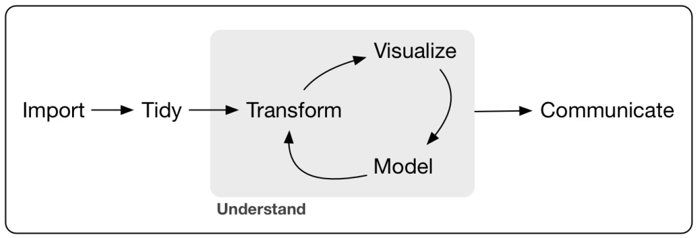

```{r setup, include=FALSE}
knitr::opts_chunk$set(echo = TRUE)
```

\begin{center}
\large{\textbf{Lab 1: Getting Started with R}}
\end{center}

## 1. An introduction to R and RStudio
### 1.1 About R/R Studio
  + \texttt{R} is a programming language developed by statisticians for data analysis and visualization
  + Open-source and free
  + RStudio is an integrated development environment (IDE) for R. It includes a console, syntax-highlighting editor that supports direct code execution, as well as tools for plotting, tracking data-analysis history, and workspace management.To participate in this workshop, you need to install R and RStudio according to your operating system. 

* Installing [R](https://ftp.fau.de/cran/)
* Installing [RStudio](https://posit.co/download/rstudio-desktop/)

### 1.2 Additional fascinating advantages of R
  + Compatible with \LaTeX
  + Write dynamic documents with \texttt{R Markdown}
  + Build your own personal website with \texttt{Blogdown}

### 1.3 A few notes on using R
  + Equal sign: <-, =, ==
  + Escape sign: \\
  + Pound sign: #
  + Semicolon sign: ;
  + Colon sign: :
  + Question mark: ?
  + Install packages: \texttt{install.packages("")}
  + Load packages: \texttt{library()} or \texttt{require()}
  + Execute codes: \texttt{Run} button or shortcut key ("Command+Enter" on Mac and "Control+Enter" on Windows)
  + Fold code chunks: "Command+Option+L"
  + Clear the console: "Control+L"
  + Clear the environment: \texttt{rm(list = ls())}

### 1.4 About RStudio
RStudio is an integrated developed environment (IDE) for \texttt{R}. The interface of RStudio is composed of four panes:

  + _Environment/History/Connections_: display all scales, vectors, data sets, and data frames
  + _Files/Plots/Packages/Help/View_: present plots and help documentation
  + _Console_: show \texttt{R} outputs and messages
  + _Script_: the place where you write an \texttt{R} script (and other scripts)


## 2. Workflow

<div align="center"> Figure 1. A typical workflow in \texttt{R} suggested by Wickham and Grolemund (2017)

</div>

  (1) Set up a folder for your project and put relevant files in that folder
  (2) Create or open an \texttt{R} script in RStudio
  (3) Set a work directory in accordance with the location of the previous folder using the \texttt{setwd()} command (forward sign / on Mac and two backslash signs on Windows \\\\)
  (4) Read in data
  (5) Data cleaning, manipulation, and analysis
  (6) Save the \texttt{R} script and data file (if necessary)
  (7) Run the \texttt{R} script from beginning to the end to make sure all results are replicable.

```{r message=FALSE}
rm(list = ls())
# clear the environment
setwd("/Users/lingzhu/Dropbox/UH Teaching/POLS6382_2025/2025 Labs/Lab 1")
# set work directory
lab1data <- read.csv("Lab 1.csv", stringsAsFactors = FALSE)
# import the data set
lab1data$surveydate <- as.Date(lab1data$surveydate, format = '%m/%d/%y')
# data cleaning
lab1data$female <- lab1data$gender=="female"
lab1data$gender <- as.factor(lab1data$gender)
# data manipulation
lmreg <- lm(lab1data$income ~ lab1data$education + lab1data$age, data = lab1data)
# data analysis
write.csv(lab1data, file = "workflow.csv")
# save the data file
```

## 3. Data Structure in R
  + Scale: a single value
  + Vector: a set of values that appear in the form of number, character, date, factor, or boolean values
  + Matrix: a two-dimension array composed of numeric vectors with equal number of elements
  + List: a mix of different kinds of vector (key-value pairs)
  + Data frame: a special list with equal number of elements for each vector

```{r}
value <- 8; value
# this is a scale
```

```{r}
vector1 <- c(1, 2, 3); vector1 # c() refers to the concatenate() function
# this is a numeric vector
```

```{r}
vector2 <- c("apple", "orange", "banana"); vector2
# this is a character vector
```

```{r}
matrix <- matrix(c(1,2,3,4,5,6,7,8,9,10,11,12), nrow = 3, 
                 byrow = T, dimnames = list(c("a", "b", "c"), 
                                        c("var1", "var2", "var3", "var4"))); matrix
# this is a matrix
```

```{r}
list <- list(a=c(1,3,5), b=c("China", "Finland", "UK", "US")); list
# this is a list
```

```{r}
dataframe <- as.data.frame(matrix); dataframe
# this is a dataframe
```


## 4. Calling Out Elements and Variables
### 4.1 Subscript within square brackets
  + var[i]: select the $i_{th}$ element in var
  + var[c(1, 3)]: select the $1^{st}$ and $3^{rd}$ element in var
  + dataframe[i, j]: select from a dataframe the element in the $i_{th}$ row and $j_{th}$ column
  + dataframe[ , m:k]: select columns from m to k
  + dataframe[c:f, ]: select rows from c to f

```{r}
lab1data$income[10]
# show the 10th person's income
lab1data$income[c(5, 7)]
# show the 5th and 7th person's income
lab1data[5, 7]
# show the element corresponding to the 7th column and 5th row
head(lab1data[ ,5:7], 10)
# show the first 10 rows of age, union, and height
lab1data[105:115, ]
# show the values of all variables for the 105th to 115th persons
```

### 4.2 The dollar sign
```{r}
head(lab1data$income)
head(lab1data[ , 2])
```

### 4.3 The attach() function
```{r}
attach(lab1data)
head(income)
```


## 5. Generating and Importing Data
### 5.1 Random sampling
```{r}
head(rnorm(100, mean = 10, sd = 2.5))
```

### 5.2 Customized data
```{r}
values <- c(1, 3, 5); values
vector1 <- seq(5, by=5, length=20); vector1
vector2 <- rep(values, times = 3); vector2
vector3 <- rep(values, c(1, 2, 3)); vector3
```

### 5.3 Import an external dataset
  + read.csv()
  + read.xlsx(): need to install and load the \texttt{openxlsx} package
  + read.dta()
  + read.dta13(): applicable to dta files generated from \texttt{Stata} in a version above 12.0. The \texttt{readstata13} package should be installed and loaded before using this command.
  + read.table()

```{r}
csvdata <- read.csv("Lab 1.csv")
library(readstata13)
csvdata <- read.dta13("cgss2015.dta")

library(haven)
csvdata <- read_dta("cgss2015.dta")
```


## 6. Data Manipulation
### 6.1 Add variables to a dataframe
  + dataframe$newvar: make sure this variable name doesn't exist in the data set, or the original variable will be overwritten by the new variable

```{r}
names(lab1data) 
# display variable names in the existing dataset, 10 variables in total
lab1data$year <- 2015 ; names(lab1data)
# year was added to the dataset
```

### 6.2 Drop variables from a dataframe
  + dataframe[ , -i]
  + dataframe[ , -i:-j]
  
```{r}
otherdata <- lab1data
# create a duplicate of the existing data set, and name it as other data
names(otherdata)
# show the variable names
otherdata <- otherdata[ , -10]
names(otherdata)
# drop the 10th variable (female)
otherdata <- otherdata[ , -6:-9]
names(otherdata)
# drop union, height, weight, and surveydate
```

### 6.3 Select a subset from the dataframe based on rows (observations)
  + dataframe[which, ]
  + _which can be any condition in relation to observations_

```{r}
union.no <- lab1data[lab1data$union == "no", ]; dim(union.no)
union.yes <- lab1data[lab1data$union == "yes", ]; dim(union.yes)
```

### 6.4 Select a subset from the dataframe based on columns (variables)
  + newdata <- subset(olddata, select = c(var1, var2, ...))
  + newdata <- subset(olddata, select = - c(var1, var2, ...))

```{r}
data1 <- subset(lab1data, select = c(id, income, education, gender)); head(data1)
data2 <- subset(lab1data, select = c(id, age, union)); head(data2)
data3 <- subset(lab1data, select = - c(age, union)); head(data3)
```

### 6.5 Merge two datasets
  + mergeddata <- merge(dataframe1, dataframe2, by = "id", all.x = T, all.y = T)
  + mergeddata <- merge(dataframe1, dataframe2, by = c("id", "year"), all = T)

```{r}
mergeddata <- merge(data1, data2, by = "id", all.x = T, all.y = T); dim(mergeddata)
# the mergeddata is totally the same as the "sum" of data1 and data2 (i.e. lab1data)
```

### 6.6 Append one dataset to the other
  + appendeddata <- rbind(union1, union2) 
  + _Note that the two data frames should have exactly the same variables_

```{r}
appendeddata <- rbind(union.no, union.yes); dim(appendeddata)
```

### 6.7 Reshape the data structure from wide to long
  + library(reshape2)
  + newdataframe <- melt(dataframe, id = c("var1", "var2", ...))

```{r}
wide.grades <- as.data.frame(matrix(round(rnorm(12, 80, 5), 0), nrow = 4, byrow = T, 
                                    dimnames = list(1:4, c("Chinese", "Math", "English"))))
wide.grades$Name <- c("Zhao", "Qian", "Sun", "Li")
head(wide.grades)
library(reshape2)
long.grades <- melt(wide.grades, id = c("Name")); long.grades
```

### 6.8 Rename variables
  + names(dataframe)[names(dataframe) == "oldname"] <- "newname"

```{r}
renamedata <- lab1data
names(renamedata)
names(renamedata)[names(renamedata) == "id"] <- "identity"
names(renamedata)
```

## 7. Linear Regression Analysis
### 7.1 Running a linear regression

  + model <- lm(y~x1+x2+x3, data = dataset): the basic command for running a multivariate linear regression
  + model$coef: check out the regression coefficients
  + summary(model): display the regression results
  + stargazer(model): output the model results in a professional way
  + plot(model): visualize model results and post-estimation diagnosis

```{r}
lab1data$logincome <- log((lab1data$income+1), base = 10)
linear.model <- lm(logincome ~ education+gender+age+I(age^2)+as.factor(union), data=lab1data)
linear.model$coef
# you can also check out residuals, fitted values, degrees of freedom, etc.
```

### 7.2 Outputing the regression results

```{r}
summary(linear.model)
```

```{r}
library(stargazer)
stargazer(linear.model, type = "text", title = "Table 1. The linear regression results")
```

## 8. The Tidyverse Package

R is a tool developed by statisticians in the 1990s to facilitate statistical analysis. Now it has become increasingly popular not only in academia but also in the business sector. With a particular focus on the tidyverse, this session aims to introduce h some basic data wrangling and visualization skills in R. 

As a programming language, R has a number of built-in packages and functions. In addition, there are many packages and functions developed by third parties to make R more useful and powerful in various contexts. Tidyverse is just one of them. It is a collection of R packages developed principally by Hadley Wickham and his collaborators. These packages have made R an especially powerful tool for data wrangling, analysis, modeling, and visualization.

What does tidyverse include?

```{r warning=F, message=F}
library(tidyverse)
tidyverse_packages()
```

Although there are many packages in the tidyverse family, some are more popular and useful than others. The core packages we are going to learn in this course include 

* tibble
* readr
* tidyr
* dplyr
* ggplot2


### 8.1 Tidying Data with tidyr: Separating and Uniting variables

```{r}
# Loading a dataset from the AER package 
# You can use data(package=.packages(all.available=TRUE)) to check out all available datasets
data(Fatalities, package="AER")
Fatalities <- as_tibble(Fatalities)
Fatalities %>%glimpse()
```


If we want to split the year variable into two variables: century and year, we can use the **separate()** function.

```{r}
Fatalities %>% 
  separate(year, into=c("century", "year.new"), sep=2) %>% 
  head()
```

In other cases, we may want to combine multiple columns into one. For instance, we may have one column called city and another column called state. It might be a good idea to organize the two pieces of information in this way: Saint Louis, MO. The **unite()** function can be helpful for this purpose.

Suppose we want to combine _state_ and _year_ in the **Fatalities** data set. 

```{r}
Fatalities %>% unite(StateYear, c(state, year), sep="-") %>% head()
```

### 8.2 Transforming the data structure

Data can be stored in various formats, with wide and long formats being the most common in quantitative analysis. We can convert the two structures using **stack()** and **unstack()** functions in base R. But in tidyverse, we use the pivot functions (**pivot_longer()** and **pivot_wider()**) for that task.

#### 8.2.1 Pivot_longer()

This function is equivalent to the **stack()** function in base R. Suppose we have a small data set as follows.

```{r}
gdp <- tibble(country=c("US", "Canada", "Mexico"),
              year2021=c(23, 2, 1),
              year2020=c(20, 1.9, 0.8),
              year2019=c(19, 1.8, 0.75))
head(gdp)
```

If we want to stack the three columns relating to year, we can write code as follows.

```{r}
gdp_longer <- gdp %>% 
  pivot_longer(c(year2021, year2020, year2019), names_to="year", values_to="gdp")
gdp_longer
```

#### 8.2.2 Pivot_wider()

**pivot_wider()** is the opposite of **pivot_longer()**. This function can be helpful if you want to make sure each unique observation is represented by a single row.

```{r}
gdp_longer %>% pivot_wider(names_from="year", values_from="gdp")
```

If you use the built-in **unstack()** function, the **country** variable will be omitted.

```{r}
unstack(gdp_longer, gdp~year)
```

### 8.3. Manipulating Your Data with dplyr

The _dplyr_ is perhaps one of the most popular packages in tidyverse. It is efficient in transforming your data through filtering, selecting, sorting, ordering, renaming and summarizing. Additionally, it also allows you to add new variables and group observations. In short, the _dplyr_ is all you need for data wrangling in R.

* filter(): Pick observations by their values
* arrange(): Sort the dataset by reordering the rows
* relocate(): Change the order of variables
* select(): Pick or drop variables by their names
* rename(): Change variable names
* mutate(): Create new variables 
* case_when(): Create new variables based on other variables
* group_by(): Transform the dataset into group-based structure and changes the scope of each function from operating on the entire dataset to operating on it group-by-group 
* summarise(): Collapse many values down to a single summary

```{r}
# A quick look at some rows in the data file
Fatalities %>% filter(year==1982) %>% glimpse()
# With logical operators
Fatalities %>% filter(year==1982 | year==1983 | year==1984) %>% nrow()
# The "in" operator
Fatalities %>% filter(year %in% c(1982,1984)) %>% nrow()
```
What if you want to sort in order of year and state?

```{r}
Fatalities %>% arrange(desc(year), desc(state)) %>% head()
```
Keep in mind that when you sort data, missing values are always sorted at the end.

We can also use select(), group_by() and summarize() to explore the data structure. 

```{r}
Fatalities%>%
select(state,year, income) %>%
group_by(year) %>%
summarize(count = n(),mean_income = mean(income), sd=sd(income)) %>%
print()
```


## 9. Data Visualization Using ggplot2
### 9.1 Basics of package ggplot2
In this section, we learn how to use ggplot2 to create various plots including histograms, box plots, scatter plots, bar plots, dot plots, pie charts, line plots, and maps. To learn ggplot2, you must get familiar with several key concepts first.

* **Plotting aesthetics**: according to R4DS, "an aesthetic is a visual property of the objects in your plot. Aesthetics include things like the size, the shape, or the color of your points." Each aesthetic property can represent a variable. For example, you can use two different colors red and blue to distinguish the Republican Party from the Democratic Party in a single plot. In that case, we say the party variable is **mapped** to the plot via color.
  
  + size
  + color
  + shape (point, line)
  + width (line)

* **Geometric objects**: given the same set of data, one can create different plots. For instance, you can create a histogram to visualize student heights. Additionally, you may also choose a box plot. The difference arises from the geometric object you choose.

  + geom_histogram()
  + geom_point()
  + geom_bar()
  + geom_line()
  + geom_boxplot()
  + geom_dotplot()
  + geom_segment()
  + geom_text()
  + geom_polygon()
  + ...
  
* **Layered plotting**: the plotting in ggplot2 is implemented based on a layered grammar of graphics. That means after creating a basic plot, you can continue to add more layers to that plot by using a plus sign.
  
  + For instance, after creating a point plot of Y against year, you may continue to add one more layer by using a **geom_line()** to connect those points.
  + After creating a dotplot with the **geom_dotplot()** function, you may continue to use the **geom_segment()** function to add a second layer to make the plot look better.

* If you want to fine-tune your plot, such as adjusting the background, changing label size or editing plot legends, you can do this through the **theme()** function. To facilitate plotting, the **ggplot2** package has already provided quite a few built-in themes.

  + theme_classic()
  + theme_bw()
  + theme_grey()
  + theme_gray()
  + theme_dark()
  + theme_light()
  + theme_minimal()
  + theme_void()
  + ...

* If the built-in themes and the **theme()** function fall short of your expectation, you can change lots of plotting properties such as x- and y-scales as well as colors and coordinates through additional functions such as **labs()**, **scale_x_continuous()**, **scale_fill_manual()** and **coord_flip()**. Again, these functions are added to your plotting code via a plus sign.

Below is a code template.

```{r}
# ggplot(data = <DATA>) + 
#   <GEOM_FUNCTION>(
#      mapping = aes(<MAPPINGS>),
#      stat = <STAT>, 
#      position = <POSITION>) +
#   <COORDINATE_FUNCTION> +
#   <FACET_FUNCTION>
```

### 9.2 Histograms

This unit utilizes the **Fatalities** data set from the AER package. Load the data set first.

```{r, message=F, warning=FALSE}
# Loading the Fatalities dataset
data(Fatalities, package="AER")
```

Let's create a histogram for the **spirits** variable first.

```{r}
Fatalities %>% ggplot(mapping=aes(x=spirits)) + geom_histogram()
```

When you create a histogram with ggplot2, there are many arguments that have been optimized unless you specify them directly. For instance, the default number of bins is 30, and the default fill color of each bin is black. We can change those plotting styles by specifying arguments in the **geom_histogram()** function.

Additionally, we can also pick a theme to make the plot look a bit better.

```{r}
Fatalities %>% ggplot() +
  geom_histogram(aes(x=spirits), bins=25, col="black", fill="lightgrey") +
  theme_bw()
```

What if you want to change the grid lines in the main plotting area? That involves the setting of the **theme()** function.

```{r}
Fatalities %>% ggplot() +
  geom_histogram(aes(x=spirits), bins=25, col="black", fill="lightgrey")+
  theme_bw()+
  theme(panel.grid.minor=element_blank(), panel.grid.major=element_blank())
```

Additionally, you can also set axis properties (axis labels, ticks, titles) within the **theme()** function.

```{r}
hist.plot <- Fatalities %>% ggplot() +
  geom_histogram(aes(x=spirits), bins=25, col="black", fill="lightgrey")+
  theme_bw()+
  theme(panel.grid.minor=element_blank(), panel.grid.major=element_line(size=0.2),
        axis.text.x=element_text(size=rel(1.5), angle=0, hjust=0.5),
        axis.text.y=element_text(size=rel(1.75), angle=0, hjust=0.5),
        axis.title=element_text(size=15, face="bold"),
        axis.ticks.length=unit(.3, "cm"))
print(hist.plot)
```

There are hundreds of arguments in the **theme()** function. It's not necessary to memorize all of them.

Finally, if we want to change the labels on the x- and y-axes, we can use the **labs()** function. If you want to change the scale of the two axes, we can use **scale_x_continuous()** and **scale_y_continuous()** when x and y are both continuous variables.

```{r}
hist.plot + labs(x="Spirits Consumption", y="The Number of States") +
  scale_y_continuous(breaks=seq(0, 80, 20), limits=c(0, 89))
```

Instead of typing a lot of duplicated code, we can save the previous plotting code. When we want to add more layers or change plotting properties, we just need to call out that plotting object and then use a plus sign to add what we want. It's super handy!


### 9.3 Box Plots

```{r}
Fatalities %>% ggplot(aes(x=spirits)) + geom_boxplot()
```

The above plot is just a one-dimention boxplot. What if we want to create a sub-boxplot for each subgroup of the second variable?

```{r}
Fatalities %>% ggplot() + geom_boxplot(mapping=aes(y=spirits, x=year))+
  theme_bw()+ labs(x="Year", y="Spirits Consumption")
```


### 9.4 Scatter Plots

Scatter plots involve the mapping of observations to a point. Each observation/row in the original data set becomes a point in the plot. Thus, we need to use geom_point().

```{r}
Fatalities %>% ggplot() + geom_point(mapping=aes(y=spirits, x=income), position="jitter")
# when many points overlap, use the position="jitter" to avoid overlapping
```

If we are interested in checking out different years, we can map different years to different shapes.

```{r}
Fatalities %>% ggplot() + geom_point(mapping=aes(y=spirits, x=income, pch=year), position="jitter")
# Note that the shape palette can deal with 6 discrete values at most
```

If you want to see state information as well, you can add one more aesthetic. This time consider using the color aesthetic.

```{r, warning=F}
Fatalities %>% ggplot() + geom_point(mapping=aes(y=spirits, x=income, pch=year, col=state),
               position="jitter")
```

Based on this plot, we find that the outliers seem to come from a single state. 

Although the plot conveys much information, the legend is too messy because there is insufficient space for the legend. Additionally, the color mapping does not work very well because there are too many states to map. To overcome this limitation, we can use facet, a skill that will be covered shortly. 


### 9.5 Bar Plots

```{r}
Fatalities %>% filter(year==1982) %>% 
  ggplot() + geom_bar(mapping=aes(x=jail, fill=jail), width=0.4)
```

```{r}
# Showing which states are coded as "yes" in 1982
# Filter for 1982 and jail == "yes"
Fatalities %>%
  filter(year == 1982, jail == "yes") %>%
  distinct(state)
```

### 9.6 Dot Plots

We can use the **geom_dotplot()** function to create a dot plot. The default output does not look very good, and we can add a segment to demonstrate the distance between each dot and the y-axis.

```{r}
dot.plot <- Fatalities %>% 
  group_by(state) %>%
  dplyr::summarise(spirits.avg=mean(spirits, na.rm=T)) %>%
  mutate(state=str_to_upper(state)) %>%
  ggplot(aes(x=spirits.avg, y=reorder(state, spirits.avg))) +
  geom_dotplot(binaxis="y", dotsize=0.5, fill="red", col="blue") +
  geom_segment(aes(yend=state),
               xend=0,
               color="grey", linetype="solid", lwd=0.25)+
  theme_bw()+
  theme(panel.grid.major=element_blank(), panel.grid.minor=element_blank(),
        axis.text.x=element_text(size=rel(1.5), vjust=-1),
        axis.text.y=element_text(size=rel(0.9)), axis.ticks.length=unit(.2, "cm"),
        axis.title=element_text(size=14))+
  labs(x="Spirits Consumption", y="State")+
  ggtitle("Average spirits consumption in 48 American states, 1982-1988")

dot.plot
```

Sometimes you may want to flip the coordinate system, putting your x variable on the Y axis and y variable on the X axis. This can be done through the **coord_flip()** function.

```{r}
dot.plot + coord_flip() +
  theme(axis.text.x=element_text(size=rel(1.1), angle=90, vjust = 0.5))
```
Obviously, you will need to apply the **theme()** function to change the font size for the values of the state variable because they overlap a lot.


### 9.7 Pie Charts

There is no built-in function for creating a pie chart. However, you may use a **geom_bar()** and **coord_polar()** to create one. The logic is as follows:

* You have a group variable and a value variable
* You build a stacked barplot with one bar only by virtue of the **geom_bar()** function
* You make the bar circular with the **coor_polar()** function

```{r}
Fatalities %>% 
  filter(year==1982) %>%
  ggplot() +
  geom_bar(aes(x="", y=unemp, fill=breath), stat="identity") +
  coord_polar(theta="y")
```

If you do not like this default polar coordinate system, you may use the **theme_void()** function. Additionally, you can add numeric labels and specify different colors by using **geom_text()** and **scale_fill_manual()**, respectively.

```{r}
Fatalities %>% 
  
  # Preparing data
  filter(year==1982) %>%
  select(breath) %>% 
  group_by(breath) %>% 
  dplyr::summarise(n=n()) %>%
  mutate(sum=sum(n), percentage=n/sum*100) %>% 
  
  # Creating a bar plot first
  ggplot(aes(x="", y=percentage, fill=breath)) +
  geom_bar(stat="identity") +
  
  # Adjusting the coordinate system
  coord_polar(theta="y") +
  
  # Removing the default theme
  theme_void() +
  
  # Adding numeric labels
  geom_text(aes(label=percentage), position=position_stack(vjust=0.5)) +
  
  # Choosing your preferred color
  scale_fill_manual(values=c("#E69F00", "#56B4E9"))
```

What if you want to create a plot for each year? In this case, you can use the facet feature. A facet is just a subplot created based on a subset of the entire data. You will need to decompose the data set into different years, then you create a pie chart for each year.

```{r}
Fatalities %>% 
  select(year, breath) %>% 
  group_by(year, breath) %>% 
  dplyr::summarise(n=n()) %>%
  mutate(sum=sum(n), prop=round(n/sum*100, 2)) %>%
  print(n=20) %>%
  ggplot(aes(x="", y=prop, fill=breath)) +
  geom_bar(stat="identity") +
  coord_polar(theta="y") +
  theme_void() +
  geom_text(aes(label=prop), position=position_stack(vjust=0.5), size=2.2) +
  scale_fill_manual(values=c("#E69F00", "#56B4E9")) +
  
  # Creating sub-figures with the facet function
  facet_wrap(~year, nrow=2)
```


### 9.8 Line Plots

When we have time series data, it is helpful to use line plots to show how variables evolve over time. You can plot multiple time series in one plot (e.g., interest rate, inflation rate). This can be done through a mapping of different groups to an aesthetic such as color or shape.

Keep in mind that when you create a line plot, you must specify the group variable in the **aes()** function in addition to determining x and y. Otherwise, the lines will not appear in the plot.

* if you only have one time series variable to plot, group=1;
* if you have more than one time series variable to plot, the group argument should be equal to the grouping variable.

```{r, warning=F, message=F}
Fatalities %>% 
  
  # Selecting variables for plotting
  select(year, state, fatal1517, fatal1820, fatal2124) %>% 
  
  # Filtering data by states
  filter(str_detect(state, "^w")) %>%
  
  # Transforming the data structure
  pivot_longer(fatal1517:fatal2124, 
               names_to="Age Group", 
               values_to="fatalities") %>% 
  # print(n=10) %>% 
  
  # Creating the plot
  ggplot(aes(x=year, y=fatalities, group=`Age Group`, col=`Age Group`)) +
  geom_point() +
  geom_line() + # must specify the group argument
  facet_wrap(~state, nrow=2) +
  theme_bw() +
  theme(axis.text.x=element_text(size=rel(1), angle=90, vjust=0.35), legend.position="bottom")
```
